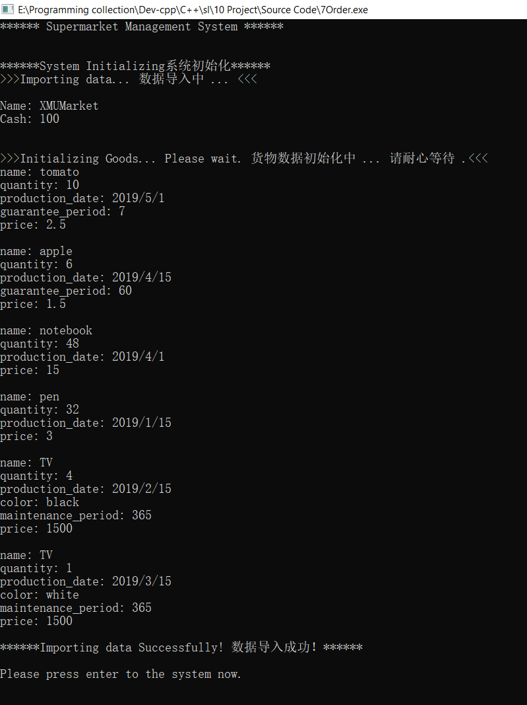

# Supermarket-Management-System
 C++ OOP Project

## 操作系统 OS
Windows
## 编程环境 Environment
Dev C++ & Visual Studio

### 模块划分 Module
*描述系统的模块划分，各个类的功能、相互间关系。可以使用类图来表示。*

超市类Class Supermarket

    数据成员：现金Cash、商品等 
    Name: XMUMarket 
    Cash: 100

商品类class Goods	

    ·包含name商品名称、production_date生产日期、price价格和quantity商品现有数量
    虚函数实现：显示商品的种类、名称、价格、现有数量 
    以其为base派生
    ·日常用品类class DailyGoods 
    ·食品类class Food
    拥有属性guarantee_period保质期属性（单位：天）。如商品已过保质期，提示应该处理，并不加入商品清单。 
    ·家电类class Electrical_Appliance
    拥有属性color颜色和maintenance_period保修时间。 

订单类class Order

    ·订单的日期时间、物品清单及信息（包括名称、数量、单价、总价等）。
    每一份订单完成后，应将订单信息打印于屏幕，并同时以txt方式保存于本地。
    以其为base派生
    ·class out购货单 商品数量减少、增加收入
    ·class in退货单  物体数量增多、减少收入   
    需有对应的购货单的ID号，并同时记录退货原因。使用友元函数、友元类实现。

*工程文件中的各代码源文件的主要作用。*

    主函数调用input()完成初始化；menu();菜单界面。
    menu()中分为：
        case 1:sell();售卖界面函数
            调用void Selling_substract(int choice)函数，做相应具体售出操作
        case 2:return_fun();退货界面函数
                调用void Return_add(int choice) 函数，做相应具体售出操作
        case 3:display();展示函数
                调用display(0);display(1);display(2);展示各个子类情况
        case 4:revenue_fun();营业额函数
        case 5:output();输出函数

*txt文件的作用。*

    market_in.txt 初始化数据
    return_out.txt 退货单 
    order_out.txt 售货单
    market_out.txt 输出

### C++ 
友元

    friend istream & operator>>(istream & in,Goods & A);
    friend ostream & operator<<(ostream & out, Goods & A);
    friend Goods operator + (Goods& g1,const Goods& g2);
    friend Goods operator - (Goods& g1,const Goods& g2);
    friend Goods operator = (Goods& g1,const Goods& g2);
    friend Goods operator * (int n, const Goods& g2);

（纯）虚函数

    通过虚函数int get_type()完成基类代码中对子类的区分。
    virtual int get_type()=0; //0 Daily  //1 Food  //2 EAppliance

动态绑定

    virtual int get_type()=0; //0 Daily  //1 Food  //2 EAppliance
    
操作符重载

    friend Goods operator + (Goods& g1,const Goods& g2);
    friend Goods operator - (Goods& g1,const Goods& g2);
    friend Goods operator * (int n, const Goods& g2);
    friend Goods operator = (Goods& g1,const Goods& g2);

### 界面 Interface

